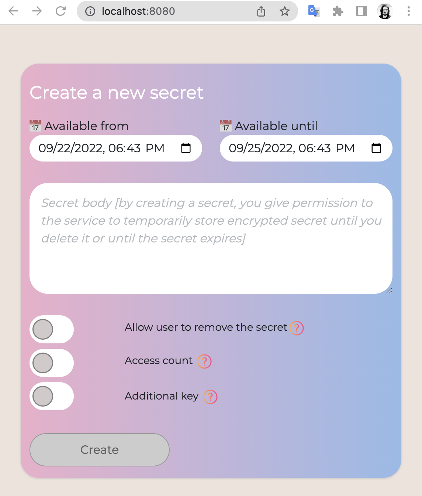
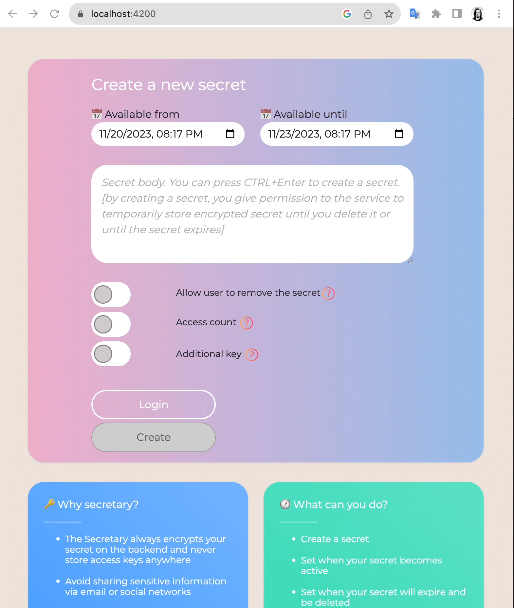

# Table of contents

- [Secretary overview](#secretary-overview) 🔑
  - [Is it rocket science?](#is-it-rocket-science) 🚀
  - [What can I do with this service?](#what-can-i-do-with-this-service) ❓
  - [What this service is about?](#what-this-service-is-about) 👍🏼
  - [What this service is NOT about?](#what-this-service-is-not-about) ⛔️
  - [How can I access this service?](#how-can-i-access-this-service) 🚦
  - [Wait a minute, I don't trust you](#wait-a-minute-i-dont-trust-you) 🧐
  - [I don't care that this is open source, it doesn't guarantee your public version is secured](#i-dont-care-that-this-is-open-source-it-doesnt-guarantee-your-public-version-is-secured) 👮🏼‍♂️
  - [It is not ideal](#it-is-not-ideal) 🌍
  - [You promised to easy spin up a container](#you-promised-to-easy-spin-up-a-container) 🚚
    - [SSL](#ssl)
    - [How encryption works](#how-encryption-works) 🔐
  - [Information for nerds](#information-for-nerds) 😎
  - [Found a bug?](#found-a-bug) 🐞
  - [Speak up](#speak-up) 📣
  - [Rather than a thousand words (demo)](#rather-than-a-thousand-words-demo) 💿


# Secretary overview 

The Secretary is a free online service that was created to securely share your confidential data with the recipient.

Many people today send sensitive data using email, social networks, or public IMs. Even though many services do a great job security wise, this doesn't solve the problems of data disposal. A hacked mailbox\account can provide an attacker with confidential information as many users keep received secrets in inboxes.
The secretary never stores unencrypted data and any keys inside that can be used to decrypt your secrets.

## Is it rocket science?

Are you kidding me? Of course not!
I know it is not the only secret sharing service available, but I’ve found this app to be different from others in the range of features it offers.

## What can I do with this service?

Obviously to share sensitive information, so you can control the policies like a boss 😎:

* You always have the option to remove your secret. Once created, You will receive 2 links, one for secret access, and the other one for deleting the secret.
* Optionally, you can allow the user (recipient) to delete the secret.
* Control how many times you want your secret to be accessed. If you set the value to '1' - it
will be deleted immediately after the user opens the secret.
* Add an additional access key. In this case, the user must enter a key next to the link to the secret before receiving the secret. For example, you can send a link using email and a key via SMS.
* You can set when you want your secret to become available. For example, you can share access to your Netflix account tomorrow from 3 PM to 4 PM. The user won't be able to access the secret until 3 PM and after 4 PM your secret will expire and be deleted.
* Feel adventurous? Feel free to integrate with the API and automate your workflow. For instance, if you are working on creating a student accounts, you can call the API to generate a link to the users password and send it to the student’s email.

## What this service is about?

* Share PIN codes.
* Share API keys.
* Share passwords.
* Share phone numbers.
* Share links to the doc (alright-alright, you can generate links in GDoc, Office365, but what if you want that link to be available only at a certain time?).
* Share your geo-location (at a specific time - frame).
* Landlord? Share your car\home locker passcode when needed.
* You want to marry a woman but you are afraid to propose in person. Well, you can say in
person that you have something great to tell at least and share a link that will become available after you leave (purely fictional example 🤵 👰 ).
      
And many other funny and sometimes not funny things.

## What this service is NOT about?

* The secretary was created only for sharing secrets, not storing.
* It is not a 1Password.
* It is not a KeyVault, Hashicorp Vault, etc...
* Seriously, want to have a password manager => use [keychain](https://support.apple.com/lv-lv/guide/mac-help/mchlf375f392/mac) :)

## How can I access this service?

Service is deployed in the public cloud and publicly accessible on [get-secret.com](https://get-secret.com) for free.

## Wait a minute, I don't trust you

This is a valid point, why do you need to trust some guy on the internet who deals with your sensitive information?
Your concerns totally make sense and for that, I decide to make this service open source. This way I hope to establish trust between us.

## I don't care that this is open source, it doesn't guarantee your public version is secured

For you, I have a few options:

* Review the source code, build the service and deploy your own instance with blackjack and hookas.
* If you are not code-friendly but still want to have your own instance, simply spin up a docker container by running a few commands.

## It is not ideal

As everything in our world. I had limited time to work on this service, but I have a lot of ideas on refactoring and bringing new features.
If the service generates curiosity I will work on evolving it further.

## You promised to easy spin up a container

*You can use your docker account, name and tag*
```
git clone https://github.com/MTokarev/secretary.git
cd secretary
docker build -t mtokarevv/secretary1:latest . 
docker run -d -p 8080:8080 --rm mtokarevv/secretary1:latest
```



If you want to put your database outside the container you can mount a volume and change the connection string inside `appsettings.json`.
On the first run if the database does not exist the Secretary will create it for you.

### SSL

While using HTTP on your localhost during development is acceptable, it is strongly recommended that you bind your server in production to HTTPS.
You can put the container behind a proxy server that will handle SSL termination, or check [this guide](https://learn.microsoft.com/en-us/aspnet/core/security/docker-https?view=aspnetcore-6.0) to see how you can pass the certificate to the kestrel server.
I am not a docker expert, but I might spend some time later on making parameters more dynamic.

## Information for nerds

* Backend is written in .NET (6).
* Multi-platform, you can build it to run on Windows, Mac, and Linux.
* Front-end uses Angular framework (14).
* Data layer uses an entity framework, hence it is easy to use any supported servers (MySQL, MSSQL, CosmosDB, etc...), but currently SQLite is used as a storage.
* Kestrel web server is used to serve both the front end and back end.
* Swagger is used to simplify API integrations.
* Throttling is enabled to protect service from robots and brute-force attacks. After 'x'  access attempts from the same IP, the request will be throttled with HTTP429 (Too many requests).

### How encryption works

**SHA256** is used as a hashing algorithm and **AES** for encryption.
If a user creates an additional key for the secret, then the service uses it to create a symmetric key, otherwise, a random guid is generated for every secret that is later used as a symmetric key.

The secretary doesn't store these keys anywhere. That means the attacker won't be able to decrypt secrets in case of service compromise unless symmetric keys are known.

## Found a bug?

Please report it in github [**issues**](https://github.com/MTokarev/secretary/issues) section.

## Speak up

Have an idea, or would like to discuss something? Please join our [discussions on github](https://github.com/MTokarev/secretary/discussions).

## Rather than a thousand words (demo)
 
 


